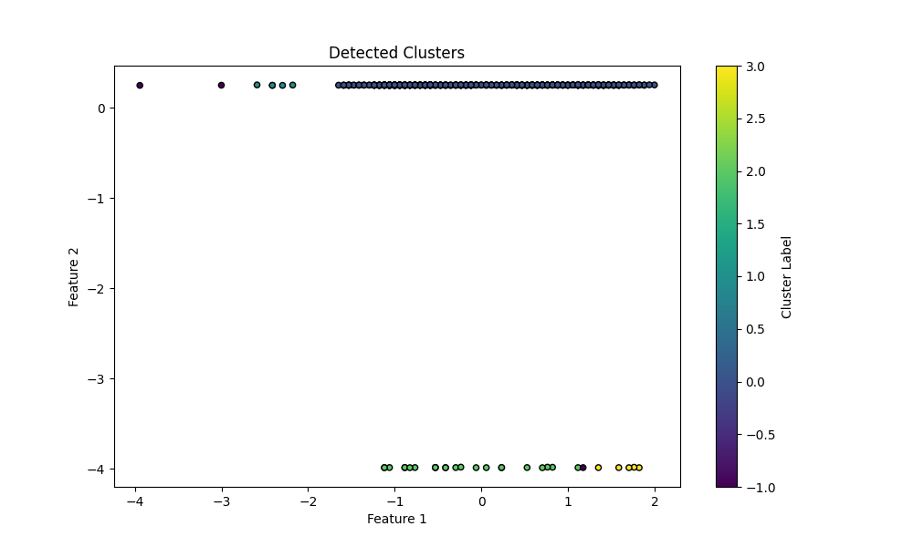

# AI Analysis Tools

This directory focuses on the application of Artificial Intelligence techniques to analyze EMF data collected in the project.

## Overview

Two main Python scripts provide the core functionality:

1. **EMF Data Classification**: Utilizes `RandomForestClassifier` from Scikit-learn to classify EMF data based on historical readings.
2. **Mycelium AI**: An unsupervised learning module using `DBSCAN` from Scikit-learn to detect patterns and clusters in real-time EMF data.

## Features

- **Data Classification**: Automates the process of labeling EMF data and evaluating the model's performance.
- **Pattern Detection**: Dynamically processes and clusters EMF data, identifying unique patterns in live sensor output.

## Usage

### EMF Data Classification

1. Load, preprocess, and split your EMF data.
2. Train a RandomForestClassifier model.
3. Evaluate the model with classification reports.

### Mycelium AI

1. Initialize the MyceliumAI with specific parameters.
2. Update live sensor data and preprocess features.
3. Detect unique patterns using the DBSCAN algorithm.

## Resources

- **Scripts**:
  - Data Classification: [emf_data_classification.py](../data_collection/scripts/emf_data_classification.py)
  - Mycelium AI: [mycelium_ai.py](../data_collection/scripts/mycelium_ai.py)
- **Images**:
  - Example plots and pattern detections: 

Ensure all dependencies, such as Scikit-learn, Pandas, NumPy, and SciPy, are installed before running these scripts.

## Contributing

We welcome contributions and suggestions on how to improve these AI analysis tools. Feel free to fork the repository, make changes, and submit pull requests. For any issues or suggestions, open an issue on the main repository.

